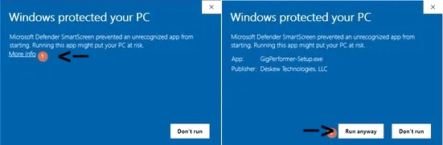
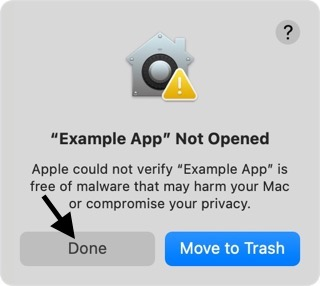
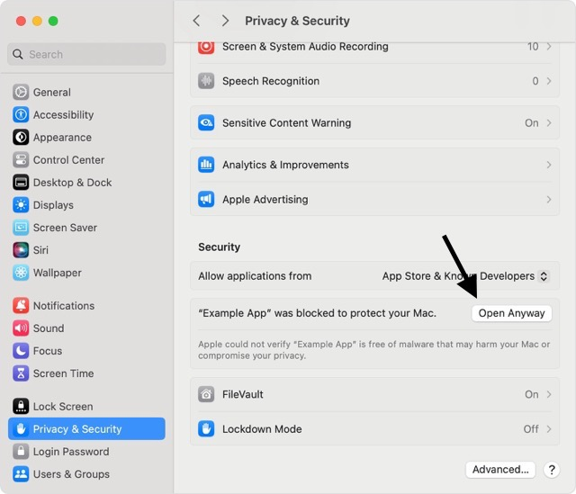

# How to Bypass the Warning of a Non-Verified App

Because the app/game is not from a verified developer, the app will have warning.

## Windows: 

When you get the pop-up that you shouldn't open the app, click on "Learn more" and click on the button that says "Run anyway".

## MacOS:

Click cancel when you get the pop-up that your mac can't verify for malware. 

Then go to Settings > Privacy and scroll down and click on the "Continue Anyway" for the app.

>[!TIP]
> If you chose "App Store & Known Developers" in the "Allow applications from" section this will mark the developer as a "known developer" which means you don't need to do this process again with their other/updated apps!