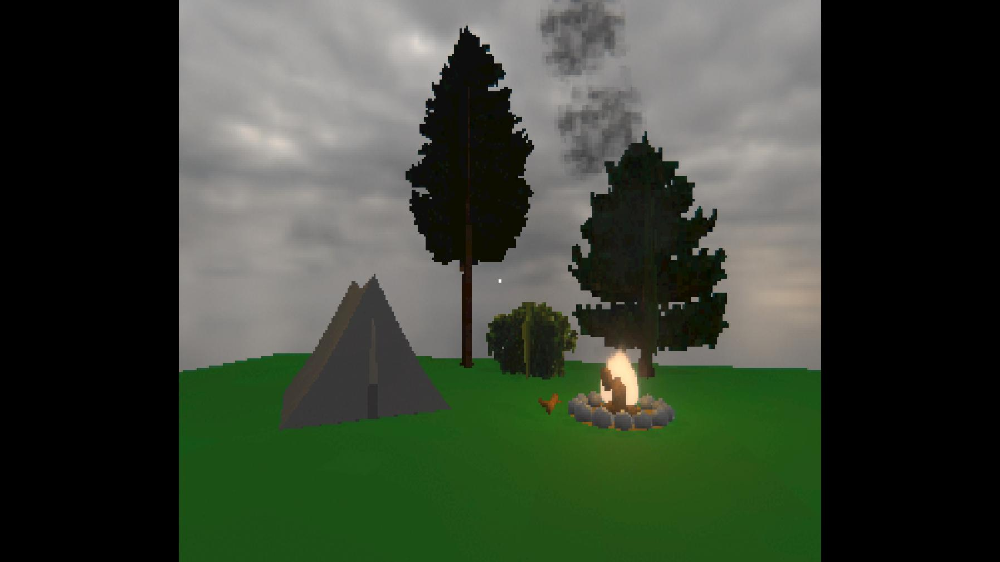

# PineOS

Welcome to my PineOS game "page"!

On here I'll show my progress and updates of my game.

> **Note:**
> Since this is made in Unity and I'm not planning to sale this game, I won't be releasing this game to the public.

## Progress/Updates

> **Note:**
> For the Prototype/Pre-Alpha I won't be showing a list of all the things I added in my updates. But I will do this in my Alpha versions.

### Alpha: Version 0.1.0

**In development! [:**
I'm planning on having this version by the end of this month (Jun 30)

#### Basic Features:
- Basic World:
    - Basic grass texture and mountain model
    - Tree models, bush model, and stick model
- Player:
    - Walking, jumping, sprinting, crouching, and collecting
    - Holding Inventory System
- Items:
    - Sticks: Used for continuing the campfire
    - Walkie-Talkie: Currently just used to show time
- Main Menu UI
    - Basic Layout of the 4 tabs: Home, Inventory, Tasks, and Settings
    - Home View:
        - Clock
    - Settings View:
        - Refrence UI of Brightness and Sound
        - Render Resoultion Selection
        - FPS Selection
- Etc.

### Prototype/Pre-Alpha

#### Version 0.0.5

[Video of Version 0.0.5](https://youtu.be/T_1Ma_qONMg)

#### Version 0.0.4

[Video of Version 0.0.4](https://youtube.com/shorts/AyqOGQn6QGA)

#### Version 0.0.3

[Video of Version 0.0.3](https://youtu.be/IyE6XSGwjE0)
